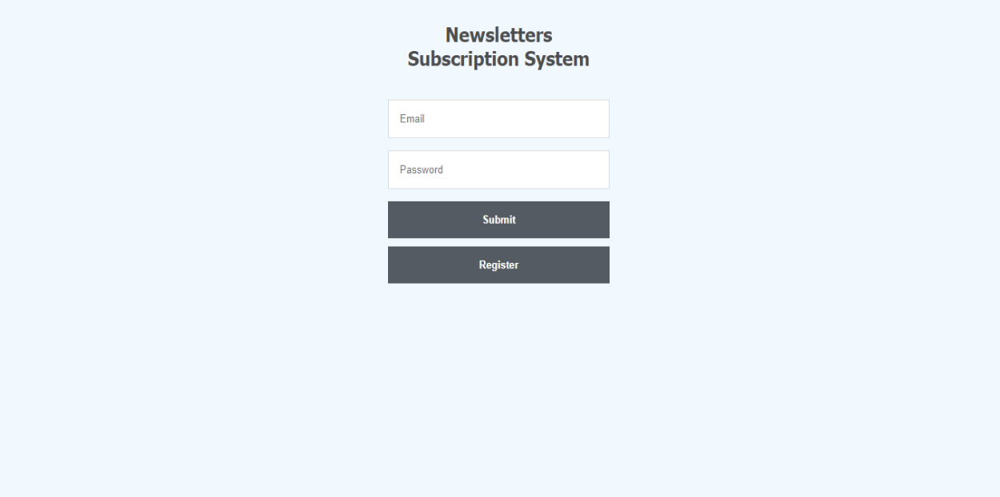
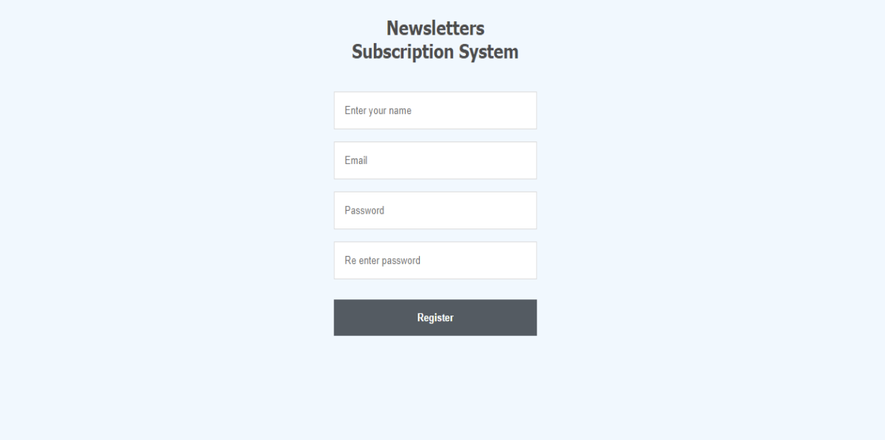
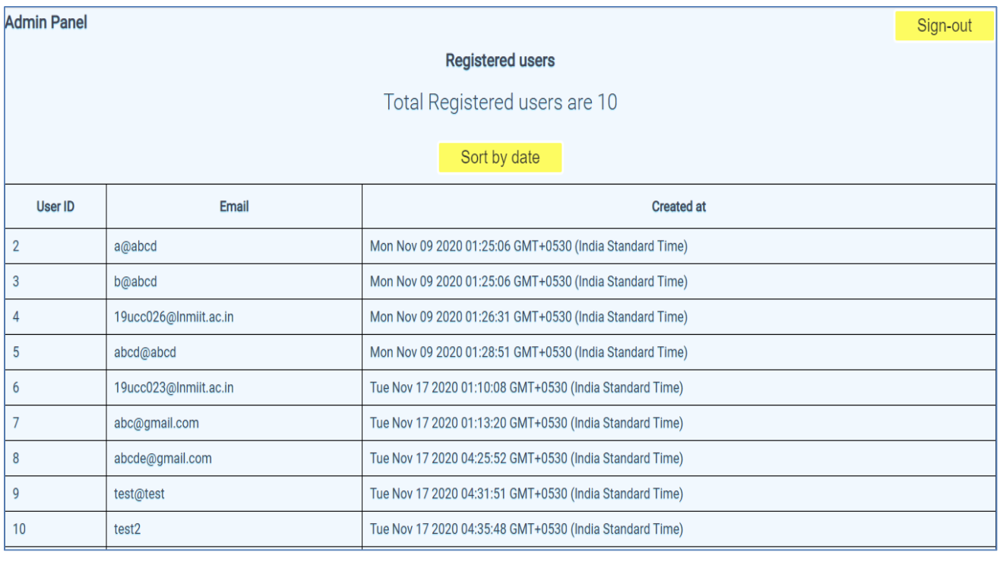
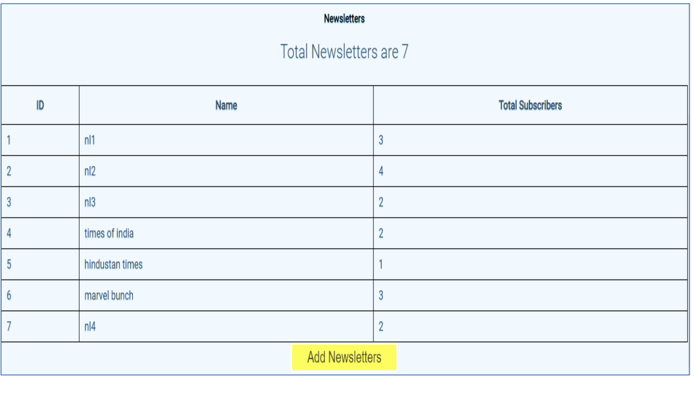
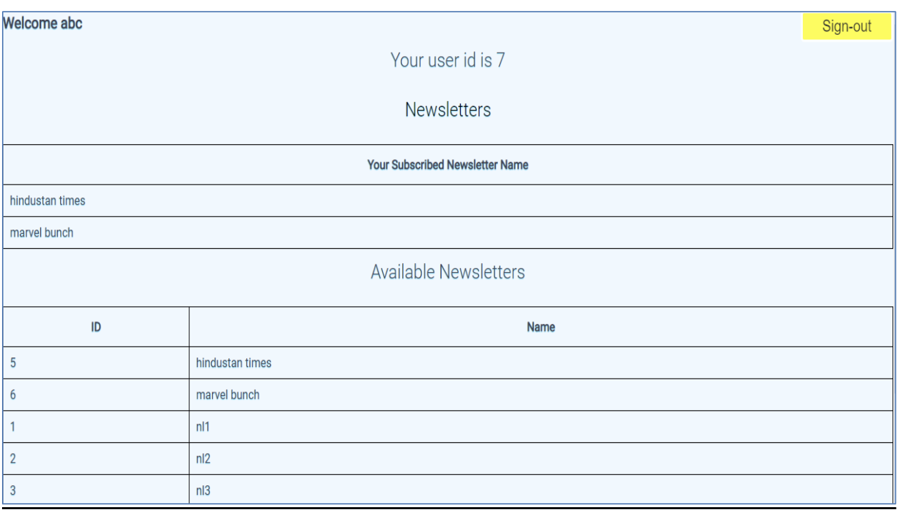
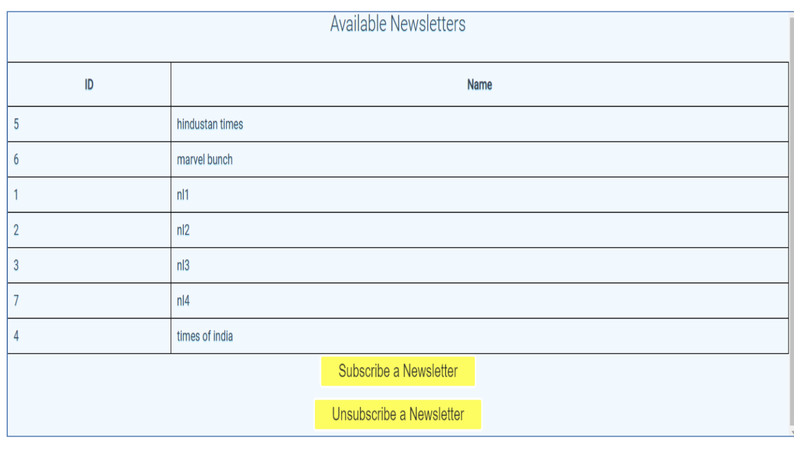
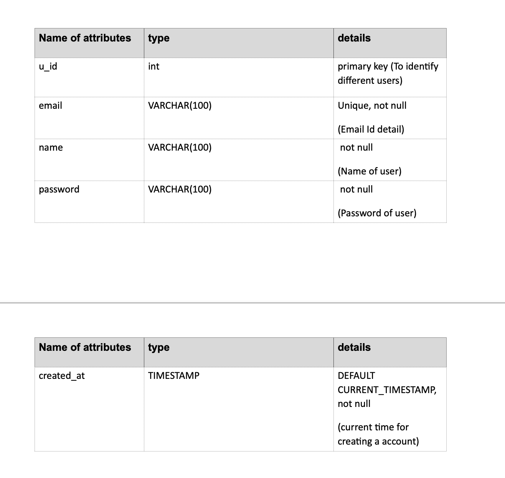
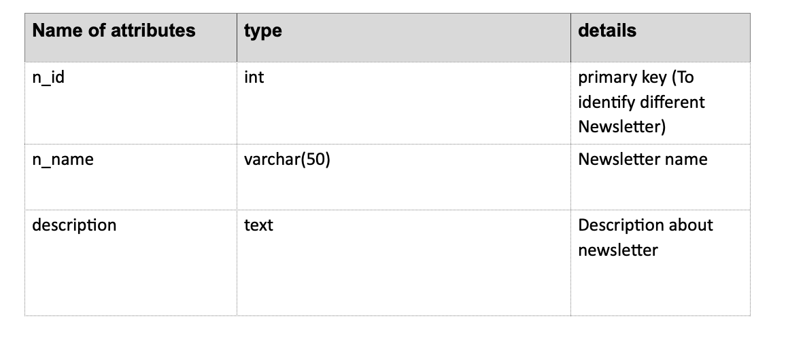
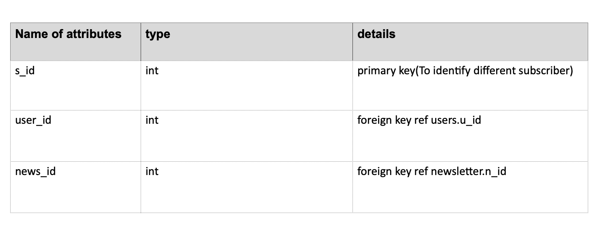

# Newsletter Subscription System
A web based software using mysql database to effectively manage newsletter subscription operations.

https://newsletter-subscription-system.herokuapp.com/

Due to no free hosting of mysql for longer period above website is not working.
## Table of Contents
1. [Tech Stack Used](#tech-stack)
2. [Set Up and Installation](#installation)
3. [Goal](#goal-of-project)
4. [Snapshots](#snapshots-of-the-project-output)
4. [Database Table](#tables-used-in-this-project)

## Tech Stack
The project mainly focuses on the Mysql database and its connectivity:
1. **MYSQL**  
MySQL is an open-source relational database management system.
2. **Express**  
A Node.js web framework which acts as a middleware for the function of creating robust APIs.
3. **HTML-CSS** 
Languages for Web interaction .
4. **Nodejs** 
Node.js is a free, open-sourced JavaScript run-time environment that lets developers write command line tools and server-side scripts outside of a browser.

 Additional Dependencies installed :

<ul>
<li>mysql
<li>body-parser
<li>ejs
<li>express-session
<li>nodemon
<li>dotenv
</ul>

## Installation

1. Installation of all the packages need to be done before hosting the Web App. Execute the following commands:
    1. `mkdir ESS && cd ESS`
    2. `git clone `
    3. `cd `
    4. `npm install`
    5. `npm run dev`

2. The app has been hosted on port : 3000 

## Goal of project
This project was made under the course of DBMS. The main aim of this project is to demonstrate relational database mysql in real world problems. 

## SNAPSHOTS OF THE PROJECT OUTPUT :

### Welcome page :

### Registration page :

### Admin panel :

### Snapshot showing functions provided in the admin panel :

### Subscriber panel :

### Snapshot showing functions provided in the subscriber panel :

## Tables Used in this project
### Table 1: USERS

### Table 2: NEWSLETTERS

### Table 3: SUBSCRIBER

